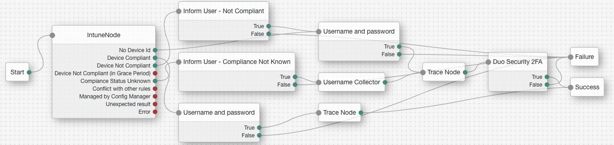

<!--
 * The contents of this file are subject to the terms of the Common Development and
 * Distribution License (the License). You may not use this file except in compliance with the
 * License.
 *
 * You can obtain a copy of the License at legal/CDDLv1.0.txt. See the License for the
 * specific language governing permission and limitations under the License.
 *
 * When distributing Covered Software, include this CDDL Header Notice in each file and include
 * the License file at legal/CDDLv1.0.txt. If applicable, add the following below the CDDL
 * Header, with the fields enclosed by brackets [] replaced by your own identifying
 * information: "Portions copyright [year] [name of copyright owner]".
 *
 * Copyright 2018 ForgeRock AS.
-->
# Microsoft Intune Node

A simple authentication node for ForgeRock's [Identity Platform][forgerock_platform] 6.5.0 and above. This node integrates with Microsoft Intune and Graph API. It allows to evaluate device's compliance posture and return the result. It also allows saving device information (to sharedState object) which can be used by subsequent nodes.

Copy the .jar file from the ../target directory into the ../web-container/webapps/openam/WEB-INF/lib directory where AM is deployed.  Restart the web container to pick up the new node.  The node will then appear in the authentication trees components palette.

##  Configuration properties of the node
#### Header containing Device ID
    We assume that TLS termination takes place before hitting AM. Termination gateway needs to take CN from device certificate presented and put into a header.

#### Azure Tenant ID
   Tenant ID could be in a form of UUID-like string or actual tenant name eg. rocknnroll.onmicrosoft.com.

#### Azure App Registration Application ID
    That is the name of the OAuth2 Client (application) that has been created, given privileges (scopes) to access API data.

#### Azure App Registration Secret
    Has to be created as part of application creation process. Keys -> Passwords section of app configuration.

#### Azure AD User Name
    Intune administrative user name who consented to giving right to the app above.

#### Azure AD User Password
    Above user's password.

#### Do you want to add Device Properties to Shared State
    When accessing GraphApi we’re also extracting some of the most important device characteristics i.e. deviceName, deviceType, operatingSystem, osVersion,deviceRegistrationState, model, manufacturer, serialNumber.
    If this option is enabled all of these characteristics will be put into shared state.

Here's a sample tree with Intune node.

 he code in this repository has binary dependencies that live in the ForgeRock maven repository. Maven can be configured to authenticate to this repository by following the following [ForgeRock Knowledge Base Article](https://backstage.forgerock.com/knowledge/kb/article/a74096897).
        
The sample code described herein is provided on an "as is" basis, without warranty of any kind, to the fullest extent permitted by law. ForgeRock does not warrant or guarantee the individual success developers may have in implementing the sample code on their development platforms or in production configurations.

ForgeRock does not warrant, guarantee or make any representations regarding the use, results of use, accuracy, timeliness or completeness of any data or information relating to the sample code. ForgeRock disclaims all warranties, expressed or implied, and in particular, disclaims all warranties of merchantability, and warranties related to the code, or any service or software related thereto.

ForgeRock shall not be liable for any direct, indirect or consequential damages or costs of any type arising out of any action taken by you or others related to the sample code.

[forgerock_platform]: https://www.forgerock.com/platform/  
